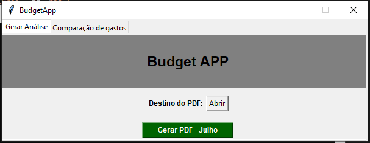
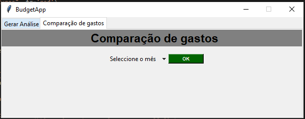
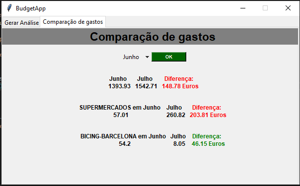
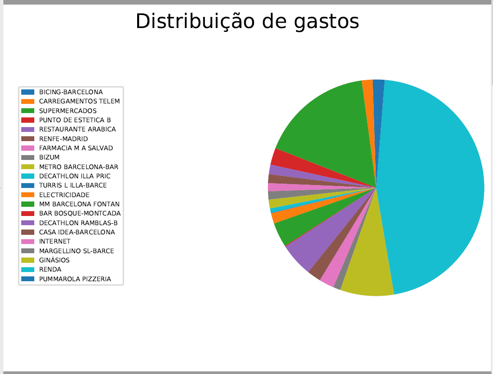
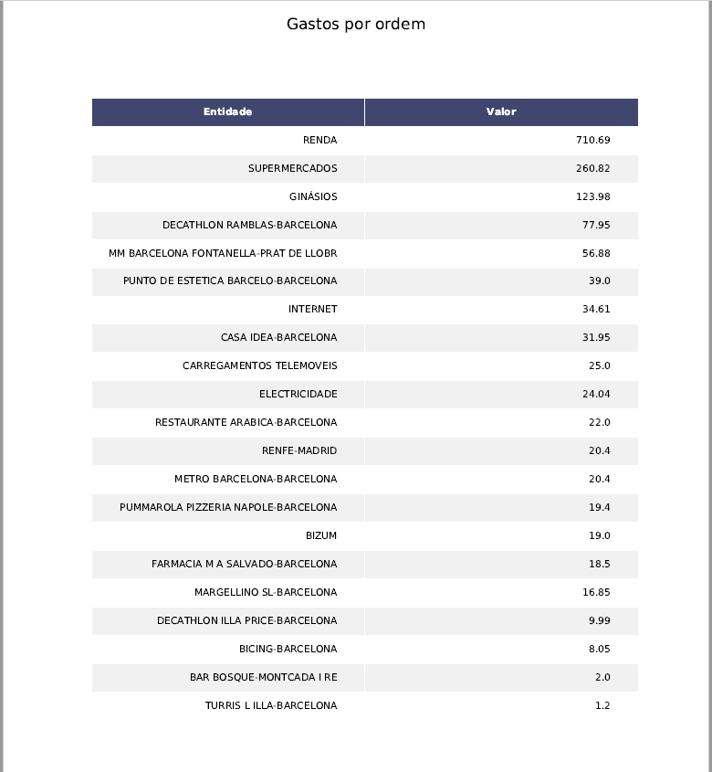

# BudgetApp

This is a Budget App built with python. This app takes the input of raw data from a gspread sheet and builds a PDF with the monthly expenses analysis.
The analysis generates a PDF that can be saved and sent to a specific set o pre-defined emails.

The analysis is made recuring to pandas, matplotlib and numpy. 

The interface is built with tkinter.

# App Preview

# Analysis Preview

Future versions will be able to serialize the dataframes so the expenses can be compared to previous months.
